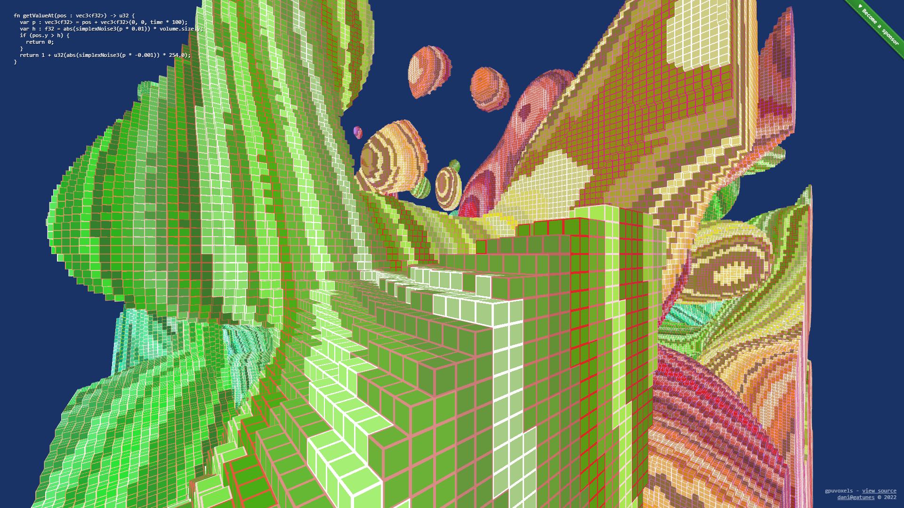

[gpuvoxels](https://github.com/danielesteban/gpuvoxels)
[](https://www.npmjs.com/package/gpuvoxels)
==

> SDF -> Voxels -> Faces -> Pixels (Works only in Chrome Canary)

[](https://gpuvoxels.gatunes.com)

### Dev environment

```bash
# clone repo:
git clone https://github.com/danielesteban/gpuvoxels.git
cd gpuvoxels
# install dependencies:
npm install
# start environment:
npm start
# open http://localhost:8080/ in your browser
```
